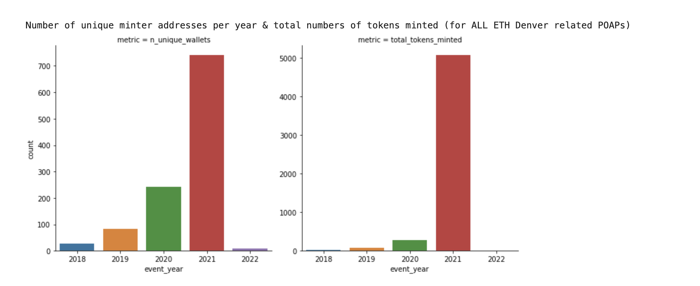
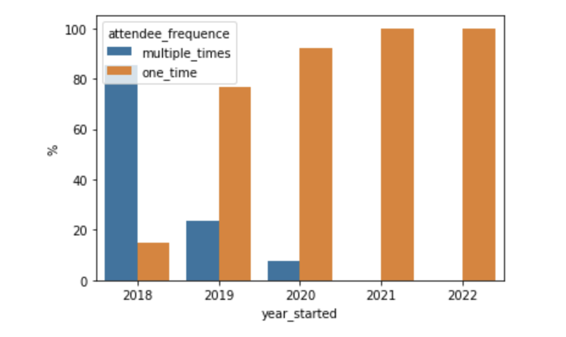
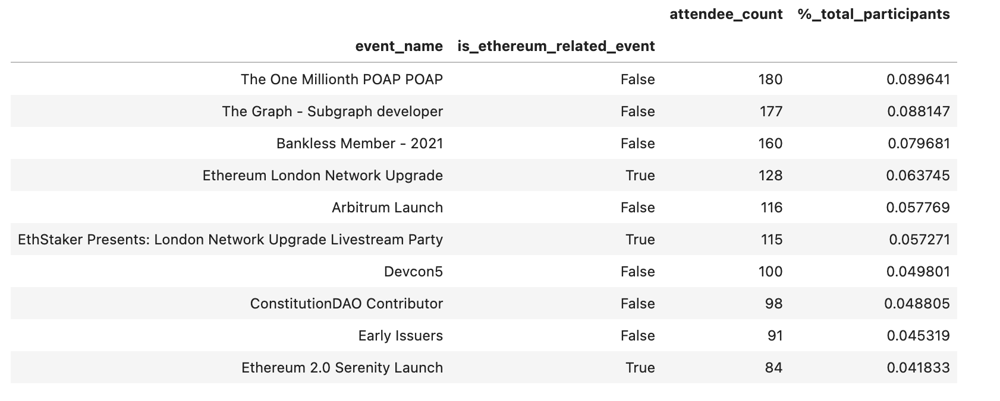
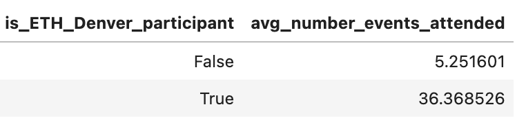
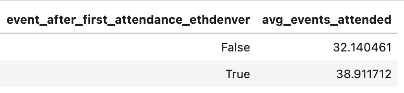
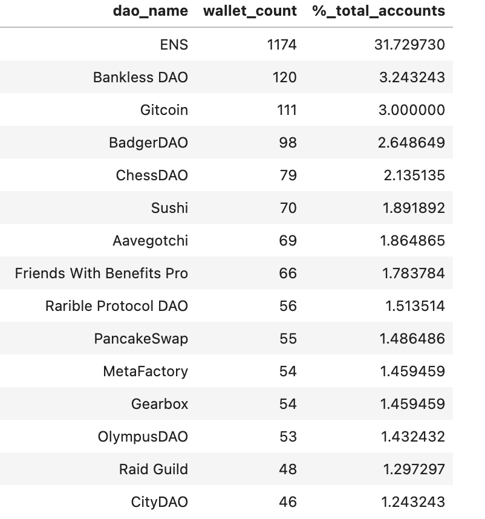

# ETH Denver participants analysis

This analysis is part of a bounty task for [Diamond DAO](https://www.diamonddao.xyz/) and the main goal here is to understand the impact of the event in the ecosystem as well as the profile of its attendees.

For more detailed information on the calculations and data for this summary check the file [here](./eth_denver_analysis.ipynb).

# Most interesting findings

- [##1](##-The-impact-of-ETH-Denver-in-other-events-attendance): An ETH Denver participant attends to almost 7x more events compared to an average POAP mintee.

- [##2](##-The-impact-of-ETH-Denver-in-other-events-attendance) An ETH Denver participant attends to 82% more events after their first participation on ETH Denver, compared to before their participation.

- [##3](##-DAO-participation) 46% of all the ETH Denver participants participate (or participated ) in at least 1 DAO as a member.

- [##4](##-DAO-participation) An ETH Denver attendee paticipate in almost 2x number of DAOs compared to an average DAO member (any DAO).

- [##5](###-Proposal-votes) 44% of all the ETH Denver participants have voted in at least 1 proposal.

- [##6](###-Proposal-votes) An ETH Denver attendee votes in almost 2x number of proposals compared to an average DAO member (any DAO).

# Analysis

_To mark a wallet as an ETH Denver attendee I considered: POAP mints, SPORK token holdings and Bufficorn mintings_.

## POAP minting

The number of new unique wallets (which we could in some sense assume as number of attendees, but with caution because people might have 2+ wallets) have sky rocketed on 2021, as well as the number of tokens minted.

At the same time, more curiosity about the space has been changing the profile of ETH Denver attendees. We can see that as the years pass by, more 'one-time' attendees have been participating in the event, difference from the small and very engaged group in the former years.

This doesn't mean this is a negative thing, more people, even with a smaller retention rate, could translate to a net increase in number of people introduced to the crypto ecossystem. But this is maybe a good reminder about the new cohorts joining ETH Denver - and how the event might adapt to these group of people.

Important (limitations with the statements above):

- A LOT of attendees might not redeem their POAPs at all or maybe redeem POAPs in different wallets, which might led to this number increasing.
- As we get closer to recent years, the fewer chances "newer" people have to attend to new events (so with time retention might go up).

## Event participation Profile

Aside from ETH Denver, these people attend to the following types of event:

- 79% of the other events are Virtual
- Only 6% of all the events are Ethereum related.

Most popular events among the cohort:

## The impact of ETH Denver in other events attendance

It's very impressive to see the difference in number of events attended when comparing ETH Denver participants to an average POAP mintee. **We are talking about almost 7x more events attended** (_values are significant at 99+% confidence level_).

At the same time, we can see the real impact of ETH Denver in people's attendance when we look at the average number of events attended AFTER the first ETH Denver participation:

**82% more events attended after ETH Denver**.

## DAO participation

Among all attendees, **46% of them are members of at least one DAO**. The most popular DAOs among the group are:

A ETH Denver participants is members of 3.14 DAOs on average, compared to 1.71 of a average DAO members (_difference is significant at 99+% level_).

## DAO activity

### Proposal creation

12% of the participants that are active in at least on DAO had a record of proposal creation. The average of proposals created is last than half of an average DAO member.

### Proposal votes

**96% of the participants** that are active in at least on DAO had a record of proposal vote. **The average number of proposals votes is almost 2x compared to an average DAO member** (_values are significant at a 99+% confidence level_).

## Other topics explored - but with no success

- **DAO treasury impact** : this is a very interesting question but there is still work to be done here - and investigation on wether how good this asnwer can be answered. I had some attempts using Dune Analytics (check [here](https://dune.xyz/queries/407734)). The problems:
  - There is not much history in the DAOhaus ecosystem for the DAOs treasury.
  - There are a lot of other DAOs using Gnosis Safe contracts that needs to have address collected and checked overtime (a lot of work).
- **Token holdings** : another very interesting question, but I tried checking specific tokens and compare average token holding vs the population average, but there was nothing interesting there. I believe checking all the token holdings during time and seeing the overlaps might be more interesting, but this would require a more extensive data collection.
