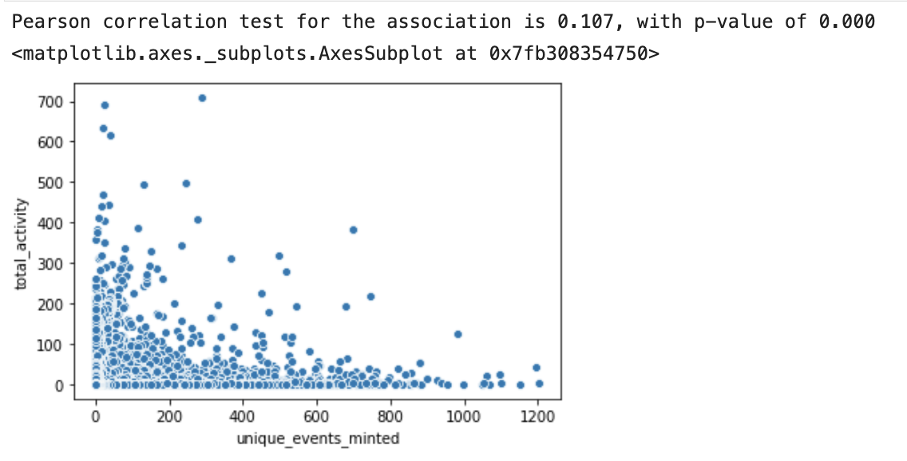

# POAP Data Landscape

This analysis is part of a bounty task for [Diamond DAO](https://www.diamonddao.xyz/) and the main goal here is to understand better the POAP ecosystem and what types of signal we could get from it.

For more detailed information on the calculations and data manipulation for this summary check the following files:

- General POAP data [here](./poap_general_analysis.ipynb).
- POAP users data [here](./poap_user_analysis.ipynb).

# Some limitations of the data

Even though there is a [good API](https://api.poap.xyz/documentation/json) directly from the POAP team and a couple of subgraphs ([here](https://api.thegraph.com/subgraphs/name/poap-xyz/poap) and [here](https://api.thegraph.com/subgraphs/name/poap-xyz/poap-xdai)) the main limitation was the fact that event issuers are not identified. There is a _host_id_ field in the API but it seems it's not been used. Also, there aren't ways to identify issuer addresses or any relavant info (even a username that would be fixed in time). This fact prevented most of the analysis associating events with DAOs in a more meaningful way to happen.

# One data cleaning detail

Among the top minters a good amount of possible bots were identified where these wallets were minting 20+ events a day for a whole year. Even when the events were presencial and in different countries. After checking the data I decided to actually stick to a maximum of 5 events a day per wallet as the majority of the wallets are located in this range, plus this sounds as a more human approach to events than the possible bots.

For more details check: POAP users data [here](./poap_user_analysis.ipynb).

# Most interesting findings

- [##1](##-2021:-the-POAP-explosion): 85% of ALL the events created in the POAP platform were created during 2021.

- [##2](##-2021:-the-POAP-explosion): ETH price seems to be fair predictor variable for the number of tokens minted.

- [##3](##-2021:-the-POAP-explosion): Even though the number of mints skyrocketed during 2021, the median number of attendees has been flat for the last 5 years , which means that the ecosystem is growing through spreading users across multiple events rather than concentrating them.

- [##4](##-2021:-the-POAP-explosion) +90% of the top minters had their first mint in 2021.

- [##5](###Most-popular-events-and-the-NFT-boom) Among the top minters, NFT related events are the most popular ones, followed by Ethereum infrastructure.

- [##6](###Most-popular-events-and-the-NFT-boom) NFT related events seem to be a very powerful tool for onboarding people to web3 and get them to participate in different types of events.

- [##7](###Most-popular-events-and-the-NFT-boom) NFT related events have on average 38% more mints than the non-NFT ones.

- [##8](###Events-as-a-DAO-activity-catalyzer) The higher the number of events attended, higher the chance of the attendee to be in a DAO.

- [##9](###Events-as-a-DAO-activity-catalyzer) More events attended translate into more DAO memberships - but do not translate into more DAO activity.

- [##10](###Events-as-a-DAO-activity-catalyzer) DAO activity of attendees increases 27% after their first event.

## 2021: the POAP explosion

2021 is a total game-changer for the POAP platform: **85% of ALL the events created in the POAP platform were created during 2021**.

The scenario for the number of tokens minted is very similar:

Although we cannot be 100% sure the exact reason why, ETH price seems like a very good predictor for this big 2021 push:

_Number of mints is in log due to the big bumps._

Although the number of events and mints are going through the roof, the median number of mints (hence attendees) per event has been flat in the last years. This indicates that the space is growing by a bigger variety of events rather than through big massive events.

Following all the data discussed above, the most engaged users in number of mints (for the whole POAP existance) started minting in 2021 (we are so early)!

_is_top_x% represents the wallets with the highest numbers of mints considering ALL years_

## Most popular events and the NFT boom

If we focus on the top 10% to 50% of the minters in the whole POAP ecosystem, we start seeing an interesting trend: NFT events are always in the top 10's:

Among the most popular events:

- Beanie x Farokh Ceasefire
- NFTFY Official Launch Party - POAP
- Metamask 10 Million Users Party
- VeeFriends x Christie's 10/01

ALL NFT related events. This leads us to some questions on **how relevant are NFT related events** among the top minters. Let's see:

_This analysis is somewhat fragile though, once to identify NFT events I am using the mention of the word NFT in either the name, description or URL, so I could be probably underestimating in a good amount here_

This is very interesting because it shows that, as we go deep into the ranks of the top minters, NFT events get more and more relevant. This let us get to the conclusion that: **NFT events might be working as a big onboarding mechanism** for the ecosystem. As people enter web3 and discover different things, they start participating in different types of events. This is so much the case that, if we take a look at the top 10 events for the top 10% minters we can see a lot of Ethereum infrastructure type of events (Eth Staking, Rocket Pool, Zapper):

The other interesting aspect about the NFT role as an onboarding tool is that it has not been an overwhelming force compared to the total amount of events (_again, I might be underestimating here due to difficulty on assigning an event as related to NFT_):

This comes as one more argument that NFTs might have been a very an important attraction point to the POAP ecosystem. In fact if we compare the average number of mints (that could be considered as a proxy for attendees) for NFT and non-NFT related events **NFT events have on average 38% more mints than the non-NFT ones** (_statistically significant for t-test with p-value < 1%_).

## Events as a DAO activity catalyzer

The first interesting thing to notice when we start connecting POAP/event data with DAO activity data (votes and proposals on-chain), is that **wallets with higher volume of POAPs minted (so more active on events) are more likely to be DAO members**:

A very similar scenario happens when we consider any DAO activity (votes and/or proposal creation):

Although, when we start going further into looking for relationships between event participation and DAO participation, we can see that **more events attended doesn't translate into more DAO activity** (_Pearson coef of 0.107 with p-value < 1%_)..

But, we can say with a fair confidence that **the more events people attend, the higher the amount of DAOs they are involved in** (_Pearson coef of 0.764 with p-value < 1%_).

Another interesting effect of the event attendance on DAO's activity is the change that happens after the first event attended. We can see from the table below that in general **event attendees increase their DAO participation in 27% after the first event attended - regardless of the type.** Another interesting thing is that it doesn't seem presencial events have and edge on virtual events - although it's important to mention that 85% of the events were create in 2021 during a pandemic that restricted a lot the amount of presencial events.

| Event Type / Moment                                                    | Before | After | Activity Lift |
| ---------------------------------------------------------------------- | ------ | ----- | ------------- |
| After first event - when it was presencial                             | 6.97   | 7.75  | +11%          |
| After first event - when it was virtual                                | 5.25   | 7.05  | +34%          |
| After the first event regardless of what it was                        | 5.70   | 7.29  | +27%          |
| After first presencial event (regardless if this was the first or not) | 7.28   | 8.63  | +18%          |
| After first virtual event (regardless if this was the first or not)    | 5.58   | 6.98  | +25%          |

_Before and After refers to average number of votes + proposals per wallet_

_PS: the same data for DAO membership would be nice but there is more to be done on data gathering scripts to achieve this_.

## DAOs with the most engagement per member

More as curiosity, I also created some event attending ranks for DAOs. Without controlling for DAO size (top 10):

_Number of unique events attended by DAO members_

If we control for DAO size things change a lot but are more exposed to high variance (I decided to limit for DAOs with at least 10 members, but could be a different number here):

_Number of unique events attended by DAO members_

## Other topics explored - but with no success

- DAO as issuers: this is the part that becomes difficult once we don't have issuer identification. It's hard to associate events to DAOs only using names, descriptions and URLs. I personally tried all these approaches but none of them showed satisfactory results.
